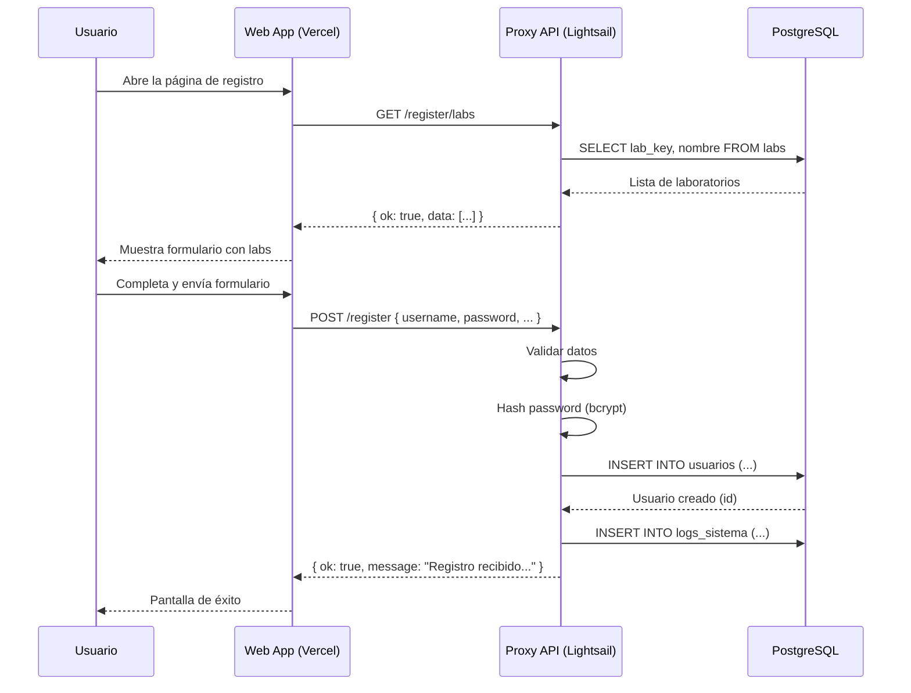

# CerperStats - Arquitectura de la Aplicación Web de Registro

## Resumen General

La aplicación de registro web es una **Single Page Application (SPA)** construida con **Next.js 15** que permite a nuevos usuarios registrarse en el sistema CerperStats. Esta aplicación se conecta a un backend proxy en **AWS Lightsail** que maneja la autenticación y persistencia de datos.

---

## Estructura del Proyecto

```
CerperStats/
├── web/                    # Aplicación web Next.js (registro)
│   ├── src/
│   │   ├── app/            # Páginas y layouts
│   │   ├── components/     # Componentes React
│   │   └── lib/            # Utilidades y API client
│   └── public/             # Assets estáticos
│
├── proxy/                  # Backend API (Express.js en AWS Lightsail)
│   ├── routes/             # Endpoints de la API
│   ├── admin/              # Panel de administración
│   └── server.js           # Servidor principal
│
├── modules/                # Módulos de lógica de negocio
│   ├── python/             # Scripts de evaluación estadística
│   ├── reports/            # Generación de reportes PDF
│   └── _common/            # Utilidades compartidas
│
└── database/               # Scripts y esquemas de PostgreSQL
```

---

## Frontend (Web App)

### Tecnologías
| Tecnología | Versión | Propósito |
|------------|---------|-----------|
| Next.js | 15.5.9 | Framework React con SSR |
| React | 18.3.1 | Biblioteca UI |
| TailwindCSS | 3.4.17 | Estilos utilitarios |
| TypeScript | 5.7.2 | Tipado estático |

### Componentes Principales

```
src/components/
├── forms/
│   ├── RegisterForm.tsx    # Formulario de registro principal
│   └── LabSelector.tsx     # Selector de laboratorios
└── ui/
    ├── GlassCard.tsx       # Contenedor con efecto glass
    ├── GlassInput.tsx      # Input con estilo glass
    ├── GlassDropdown.tsx   # Dropdown con estilo glass
    ├── GlassButton.tsx     # Botón con estilo glass
    └── Toast.tsx           # Sistema de notificaciones
```

### API Client

El archivo `src/lib/api.ts` define las funciones para comunicarse con el backend:

```typescript
const API_URL = process.env.NEXT_PUBLIC_API_URL || 'http://localhost:4000';

// Obtener lista de laboratorios
export async function fetchLabs(): Promise<ApiResponse<Lab[]>>

// Registrar nuevo usuario
export async function registerUser(payload: RegisterPayload): Promise<ApiResponse<null>>
```

### Tipos de Datos

```typescript
interface RegisterPayload {
  username: string;
  password: string;
  nombre_completo: string;
  sede: 'Paita' | 'Chimbote' | 'Arequipa' | 'Callao';
  default_lab?: string | string[];  // Máximo 2 laboratorios
}

interface Lab {
  lab_key: string;
  nombre: string;
}
```

---

## Backend (Proxy API)

### Ubicación
- **Servidor**: AWS Lightsail
- **Puerto**: 4000
- **Framework**: Express.js

### Arquitectura del Servidor

```javascript
// proxy/server.js
const app = express();

// Configuración CORS para Vercel
app.use(cors({
  origin: ['https://cerperstats.vercel.app', 'http://localhost:3000'],
  credentials: true
}));

// Rutas públicas (sin autenticación)
app.use('/register', authLimiter, registerRouter);

// Rutas protegidas (requieren JWT)
app.use('/labs', verifyToken, labsRouter);
app.use('/sessions', verifyToken, sessionsRouter);
// ... otras rutas
```

### Endpoints de Registro

#### `GET /register/labs`
Lista todos los laboratorios disponibles para selección.

**Response:**
```json
{
  "ok": true,
  "data": [
    { "lab_key": "LAB001", "nombre": "Laboratorio de Biología Molecular" },
    { "lab_key": "LAB002", "nombre": "Laboratorio de Química Analítica" }
  ]
}
```

#### `POST /register`
Registra un nuevo usuario en el sistema.

**Request Body:**
```json
{
  "username": "jperez",
  "password": "mi_password_seguro",
  "nombre_completo": "Juan Pérez García",
  "sede": "Callao",
  "default_lab": ["LAB001", "LAB002"]
}
```

**Response (éxito):**
```json
{
  "ok": true,
  "message": "Registro recibido correctamente. Su cuenta debe ser aprobada por un administrador."
}
```

### Validaciones del Backend

| Campo | Validación |
|-------|------------|
| `username` | Mínimo 3 caracteres, solo alfanuméricos + `._-` |
| `password` | Mínimo 6 caracteres, acepta cualquier caracter |
| `sede` | Debe ser: Paita, Chimbote, Arequipa o Callao |
| `default_lab` | Máximo 2 laboratorios, deben existir en DB |

### Seguridad

1. **Rate Limiting**: 5 intentos cada 15 minutos para registro
2. **No Enumeración**: Si el username existe, devuelve respuesta genérica de éxito
3. **Passwords**: Hash con bcrypt (10 salt rounds)
4. **Rol Forzado**: Todos los registros son `rol: 'analista'`, `activo: false`
5. **Aprobación Requerida**: Los usuarios nuevos deben ser aprobados por un admin

---

## Flujo de Registro



---

## Base de Datos

### Tabla `usuarios`
```sql
CREATE TABLE usuarios (
  id SERIAL PRIMARY KEY,
  username VARCHAR UNIQUE NOT NULL,
  hash_password VARCHAR NOT NULL,
  nombre_completo VARCHAR,
  sede VARCHAR CHECK (sede IN ('Paita', 'Chimbote', 'Arequipa', 'Callao')),
  default_lab TEXT[],
  rol VARCHAR DEFAULT 'analista',
  activo BOOLEAN DEFAULT false
);
```

### Tabla `labs`
```sql
CREATE TABLE labs (
  lab_key VARCHAR PRIMARY KEY,
  nombre VARCHAR NOT NULL
);
```

---

## Despliegue

### Frontend (Vercel)
```bash
cd web
npm run build
# Desplegado automáticamente via GitHub → Vercel
```

**Variables de entorno:**
```
NEXT_PUBLIC_API_URL=https://tu-servidor-lightsail:4000
```

### Backend (AWS Lightsail)
```bash
cd proxy
npm install
node server.js
# O con PM2: pm2 start server.js --name cerper-proxy
```

**Puerto por defecto:** 4000

---

## Conexión Frontend ↔ Backend

```
┌─────────────────────┐         HTTPS          ┌─────────────────────┐
│                     │ ───────────────────────│                     │
│   Vercel (Next.js)  │   /register/*          │  AWS Lightsail      │
│   cerperstats.      │   /register/labs       │  :4000              │
│   vercel.app        │                        │  Express.js         │
│                     │ ←──────────────────────│                     │
└─────────────────────┘         JSON           └─────────────────────┘
                                                        │
                                                        │ pg
                                                        ▼
                                               ┌─────────────────────┐
                                               │                     │
                                               │   PostgreSQL        │
                                               │   (AWS RDS/Local)   │
                                               │                     │
                                               └─────────────────────┘
```

---

## Comandos Útiles

### Desarrollo Local
```bash
# Frontend
cd web
npm run dev          # Inicia en http://localhost:3000

# Backend
cd proxy
node server.js       # Inicia en http://localhost:4000
```

### Producción
```bash
# Frontend - build para Vercel
cd web
npm run build

# Backend - con PM2
pm2 start proxy/server.js --name cerper-proxy
pm2 logs cerper-proxy
```

---

## Archivos Importantes

| Archivo | Propósito |
|---------|-----------|
| `web/src/app/page.tsx` | Página principal de registro |
| `web/src/components/forms/RegisterForm.tsx` | Lógica del formulario |
| `web/src/lib/api.ts` | Cliente API para comunicación con backend |
| `proxy/server.js` | Servidor Express principal |
| `proxy/routes/register.js` | Endpoints de registro |
| `proxy/db.js` | Conexión a PostgreSQL |
